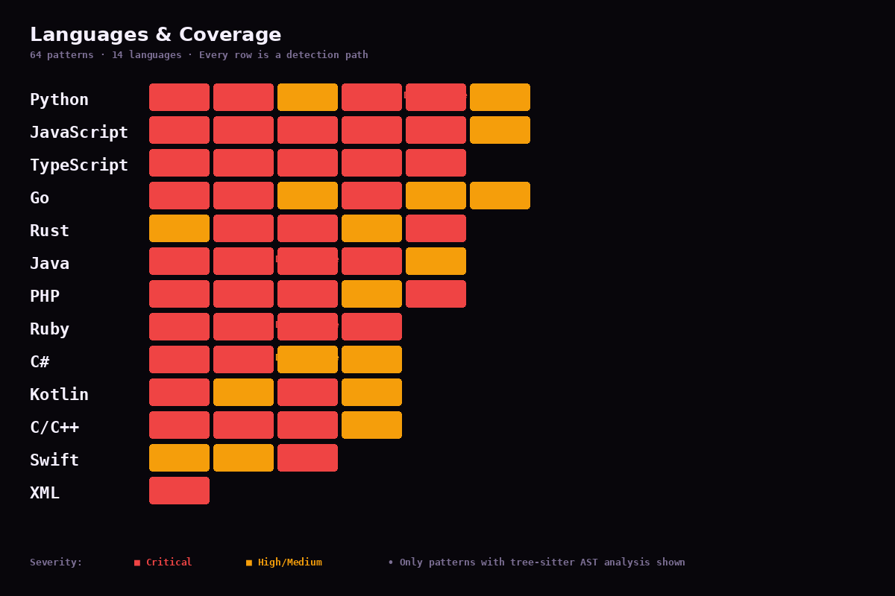
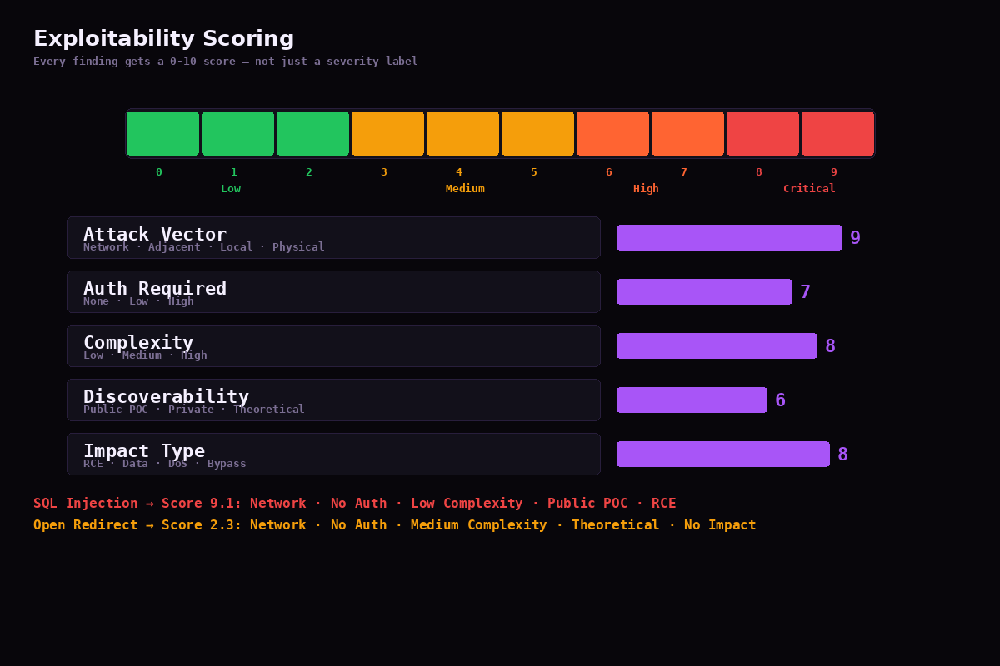
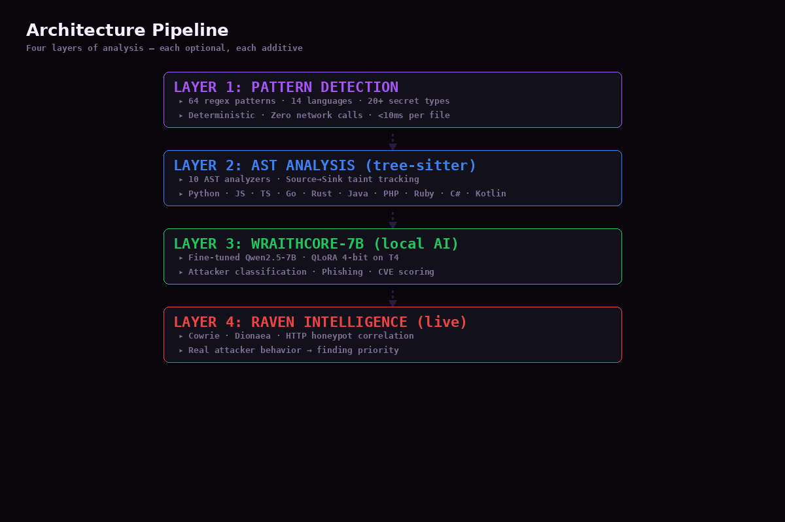
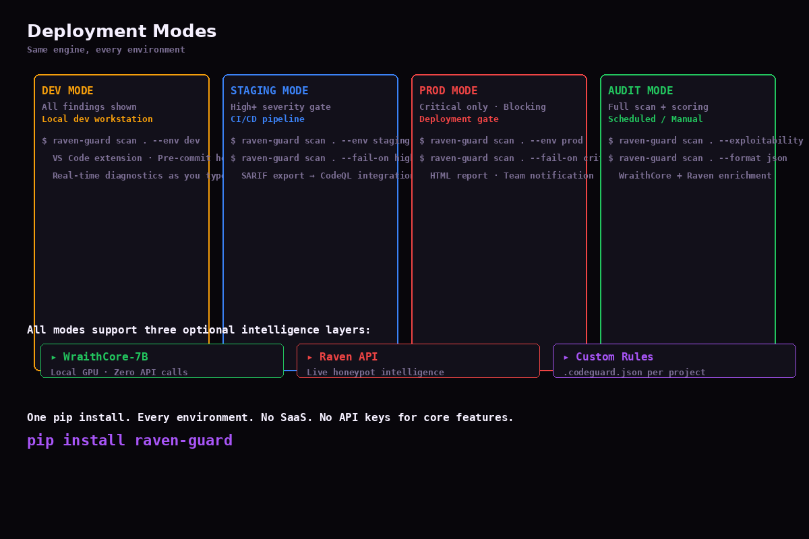

# CodeGuard Copilot — Setup Guide v0.5.0

## One Command

```bash
pip install raven-guard
```

That's it. No Docker. No Node.js. No API keys. No SaaS.

## Verify Installation

```bash
raven-guard scan . --help
```

You should see the CLI help with `scan`, `doctor`, and output format options.

## Scan Your First Project

```bash
cd your-project
raven-guard scan .
```

CodeGuard scans every supported file and prints findings to your terminal with severity, CWE, file path, line number, and a fix suggestion.

## What You Get Out of the Box

| Capability | Details |
|---|---|
| **64 Vulnerability Patterns** | SQLi, CMDi, NoSQLi, XSS, Secrets, Deserialization, Path Traversal, SSRF, Supply Chain, IaC, Memory Safety, API, Mobile, CORS, Race Conditions, Business Logic, +44 more |
| **14 Languages** | Python, JavaScript, TypeScript, Go, Rust, Java, PHP, Ruby, C#, Kotlin, C, C++, Swift, XML |
| **10 AST Analyzers** | tree-sitter deep parsing for Python/JS/TS/Go/Rust/Java/PHP/Ruby/C#/Kotlin — source→sink taint tracking, not regex |
| **Exploitability Scoring** | Every finding scored 0-10 by attack vector, auth requirements, complexity, and live POC availability |
| **Secret Detection v2** | 20+ structured secret types + Shannon entropy detection for unknown tokens |
| **0 API Calls** | Everything runs locally. No data leaves your machine. |



## Optional: WraithCore-7B (Local AI)

Runs a fine-tuned Qwen2.5-7B security model on your GPU. Zero API calls.

```bash
pip install raven-guard[wraithcore]
raven-guard scan .
```

- QLoRA 4-bit, runs on any T4 GPU (8GB VRAM)
- Classifies attackers, detects phishing patterns, scores CVEs
- Zero data leaves your machine
- Trained on 1500+ real-world examples from WraithWall honeypot network, OpenPhish, URLhaus, and CISA KEV

## Optional: Raven Intelligence (Live Honeypot Data)

Cross-references findings against live attacker behavior from WraithWall's Cowrie/Dionaea/HTTP honeypot network.

```bash
export RAVEN_API_KEY=your_key
export RAVEN_API_URL=https://wraithwall.online/api/raven
raven-guard scan .
```

Findings get tagged with `attacker_aligned`, `deception_correlated`, `breach_aligned` signals. Priority is elevated when real attackers are actively exploiting the same CWE.

## Scan Modes

### By Environment

```bash
raven-guard scan . --env prod      # critical only
raven-guard scan . --env staging   # high+
raven-guard scan . --env dev        # all findings
```

### With Exploitability

```bash
raven-guard scan . --exploitability -x
```



### Output Formats

```bash
raven-guard scan . --format sarif --output results.sarif
raven-guard scan . --format html --output report.html
raven-guard scan . --format json
raven-guard scan . --format markdown
```

## CI/CD Integration

### GitHub Actions

```yaml
- name: CodeGuard Scan
  run: |
    pip install raven-guard
    raven-guard scan . --fail-on high --format sarif --output results.sarif
```

### Pre-Commit Hook

```bash
cp hooks/pre-commit .git/hooks/pre-commit
```

Or use the `.pre-commit-hooks.yaml` in your `.pre-commit-config.yaml`.

## Custom Rules

Create `.codeguard.json` in your project root:

```json
{
  "version": "0.1.0",
  "customPatterns": [{
    "type": "Custom: Banned Function",
    "severity": "critical",
    "regex": "eval\\s*\\(.*userInput",
    "languages": ["javascript", "python"],
    "message": "eval() with user input is dangerous",
    "fix": "Use a parser or validator",
    "cwe": "CWE-95"
  }]
}
```

## VS Code Extension

Install from the VS Code Marketplace or package locally:

```bash
npm install && npm run package
code --install-extension codeguard-*.vsix
```

Features: real-time diagnostics, inline QuickFix, explain vulnerability, suppress per-finding.

## Architecture





## System Health

```bash
raven-guard doctor
```

Shows configured language support, WraithCore status, Raven connectivity, and optional dependency status.

## Getting Help

- **GitHub**: https://github.com/niffyhunt/codeguard-copilot
- **Docs**: https://wraithwall.online/docs/codeguard
- **PyPI**: https://pypi.org/project/raven-guard/
- **HuggingFace Model**: https://huggingface.co/Ezmcyber890/wraithcore-7b

## You're Ready

Open source. MIT license. 64 patterns. 14 languages. Zero API calls required.

```bash
pip install raven-guard
raven-guard scan ./
```
